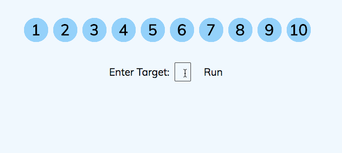
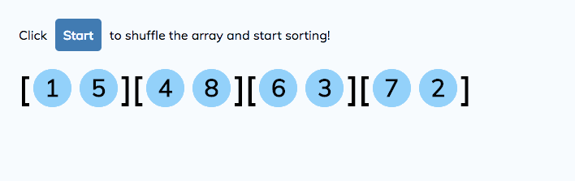

# Search and Sort Visualizer

[Search and Sort Visualizer]() is an algorithm tutorial covering some of the most common search and sorting algorithms.  With this app users will be able to view visualizations, test their knowledge by practicing exercises, and view solutions from common languages.

Search and Sort Visualizer was built in 1 week by [Andrew Yueh](https://github.com/andrew1007),
[Jeffrey Fan](https://github.com/jeffreyfan93), and [Joyce Chau](https://github.com/joycechau).

## Architecture and Technologies
The project was implemented with the following technologies:
* React for overall structure, exercise logic, and DOM manipulation
* Vanilla Javascript and ```jQuery``` for additional DOM manipulation
* Webpack to bundle and serve up the various scripts

## Features
* Algorithm demos
* Algorithm exercises
* Solutions in different languages

#### Example Demos

Binary Search




Merge Sort



## Future Implementations
Additional features to add include:
* More search and sorting algorithms
* Allow users to adjust speed of visualizations
* Add comparison metrics to compare time-complexity of the various searches/sorts
