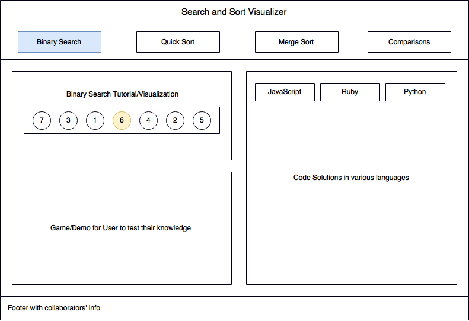

# Search and Sort Visualizer
Understanding the various sorting and searching algorithms are one of the most difficult concepts for new programmers to grasp.  This app will help to visualize some of the most common algorithms in a clear and interactive way and allow users to test their knowledge by practicing exercises.  

## Functionality and MVP
With this project, viewers will be able to:
- [ ] View visualizations of common sorting and searching algorithms (quick sort, merge sort, binary search)
- [ ] Perform exercises after each tutorial to test the user's knowledge
- [ ] View solutions of the problems in various languages (JavaScript, Ruby, Python, maybe Java)
- [ ] Allow user to test their knowledge of time-complexity by adding comparison metrics

## Wireframes

## Technologies and Technical Challenges
This app will be implemented using React. Python will also be learned during this process.  

The primary technical challenges will be:
* Implementing frontend logic to render components
* Creating smooth, bug-free visualizations and animations
* Adding comparison logic and visualizations

## Group Members and Work Breakdown

Our group consists of three members - Joyce Chau, Andrew Yueh, and Jeffrey Fan.

Joyce's primary responsibilities will be:

* Styling and polishing app
* Researching and implementing ability to animate visualizations

Andrew's primary responsibilities will be:

* Writing algorithms
* Implementing gameplay logic

Jeffrey's primary responsibilities will be:

* Implementing React logic to render components
* Implementing comparison logic

## Implementation Timeline
**Days 1-2**: Complete Tutorial/visualizations for all the searches/sorts
* Create algorithms (Andrew)
* Implement frontend logic to render component (Jeffrey)
* Style and add animation (Joyce)

**Day 3**: Complete Game/Exercises
* Implement gameplay logic (Andrew)
* Implement frontend logic to render components (Jeffrey)
* Style and add animation (Joyce)

**Day 4**: Code Snippets
* Learn Python (all members)

**Days 4-5**: Comparison Feature
* Implement comparison logic (Andrew)
* Implement frontend logic to render components (Jeffrey)
* Style and add animation (Joyce)

**Day 6**: Add finishing touches and fix all bugs
* Refactor and clean up files (Andrew)
* Set up Heroku and get custom domain (Joyce)
* Create production README (Jeffrey)

## Bonus Features
- [ ] Allow user to adjust speed of visualization
- [ ] Add additional sorting algorithms (heap, selection, insertion, etc..)
